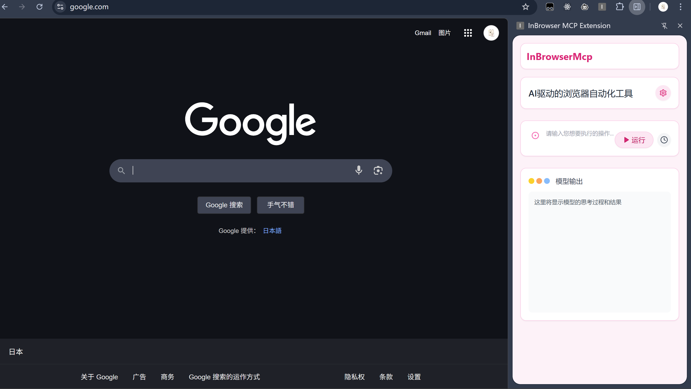

# InBrowserMcp - （开发中）

InBrowserMcp 是一个实验性项目，旨在通过 Chrome 扩展程序将模型上下文协议 (MCP) 的能力引入浏览器内部操作。

它允许 AI 模型或外部应用程序通过 MCP 标准接口向浏览器发送指令（如导航、点击、输入、获取内容等），并通过 Chrome 扩展在浏览器中实际执行这些操作。

## 项目结构

本项目包含三个主要部分：

1.  **`mcp-server`**: 后端服务 (Node.js/Express)
    *   实现了 MCP 服务器，处理来自客户端（如 AI 模型）的 JSON-RPC 请求。
    *   通过 WebSocket 与 Chrome 扩展 (`extension`) 通信，将 MCP 指令转发给扩展，并接收执行结果。
    *   提供 `/mcp` 端点用于 MCP 通信 (POST/GET/DELETE)。
    *   提供 `/api/ai-command` 端点用于接收前端 UI 发送的自然语言指令，并将其（模拟地）转换为 MCP 指令。
    *   提供 `/api/cancel-command` 端点用于取消正在进行的浏览器操作。
2.  **`extension`**: Chrome 浏览器扩展
    *   作为浏览器端的代理，通过 WebSocket 连接到 `mcp-server`。
    *   接收来自 `mcp-server` 的指令。
    *   使用 Chrome Extension API (e.g., `chrome.tabs`, `chrome.windows`, `chrome.debugger`) 在浏览器中执行指令。
    *   将执行结果或错误通过 WebSocket 返回给 `mcp-server`。
3.  **`frontend`**: 前端用户界面 (React/Vite)
    *   提供一个简单的 Web 界面，用户可以在此输入自然语言指令。
    *   通过 HTTP POST 请求将指令发送到 `mcp-server` 的 `/api/ai-command` 端点。
    *   通过 Server-Sent Events (SSE) 从 `/mcp` 端点接收 MCP 服务器的状态更新和操作结果，并更新 UI。

## 技术栈

*   **后端 (`mcp-server`)**: Node.js, Express, TypeScript, `@modelcontextprotocol/sdk`, `ws` (WebSocket)
*   **扩展 (`extension`)**: JavaScript, Chrome Extension API, WebSocket
*   **前端 (`frontend`)**: React, Vite, TypeScript, Tailwind CSS, Server-Sent Events (EventSource)

## 工作流程

1.  用户在 `frontend` UI 中输入指令（例如“打开 google.com”）。
2.  `frontend` 将指令 POST 到 `mcp-server` 的 `/api/ai-command`。
3.  `mcp-server` (模拟 AI) 将自然语言指令转换为 MCP 工具调用请求（例如 `navigate` 工具）。
4.  `mcp-server` 通过 WebSocket (`sendBrowserAction`) 将指令和参数发送给 `extension`。
5.  `extension` (在 `background.js` 中) 接收指令，调用相应的 Chrome API 执行操作（例如 `chrome.tabs.update(...)`）。
6.  `extension` 将操作结果（成功或失败信息）通过 WebSocket (`action_response`) 发送回 `mcp-server`。
7.  `mcp-server` 收到 `action_response`，解析结果。
8.  `mcp-server` 通过与 `frontend` 建立的 SSE 连接 (`/mcp` GET) 发送 `message` 或 `error` 事件。
9.  `frontend` 接收 SSE 事件，更新 UI 状态（例如从“运行中”变为“成功”或“失败”）。

## 安装与运行

**先决条件:**

*   Node.js (建议 v18 或更高版本)
*   npm 或 pnpm
*   Google Chrome 浏览器

**步骤:**

1.  **克隆仓库:**
    ```bash
    git clone <repository-url>
    cd InBrowserMcp
    ```

2.  **安装后端依赖:**
    ```bash
    cd mcp-server
    npm install
    # 或者使用 pnpm
    # pnpm install
    cd ..
    ```

3.  **安装前端依赖:**
    ```bash
    cd frontend
    pnpm install # 推荐使用 pnpm，如果使用 npm，请运行 npm install
    cd ..
    ```

4.  **加载 Chrome 扩展:**
    *   打开 Chrome 浏览器，地址栏输入 `chrome://extensions/`。
    *   启用右上角的“开发者模式”。
    *   点击“加载已解压的扩展程序”。
    *   选择项目中的 `InBrowserMcp/extension` 文件夹。
    *   确保扩展已启用。

5.  **启动后端服务:**
    ```bash
    cd mcp-server
    npm run build
    npm start
    ```
    后端服务默认运行在 `http://localhost:8080`，WebSocket 服务器监听 `ws://localhost:8081`。

6.  **启动前端开发服务器:**
    ```bash
    cd frontend
    pnpm run dev
    ```
    前端应用默认运行在 `http://localhost:5173`。

7.  **使用:**
    *   打开浏览器访问 `http://localhost:5173`。
    *   在输入框中输入指令，例如“打开 google.com”或“导航到 bilibili.com”。
    *   观察状态变化和浏览器行为。

## 注意事项

*   Chrome 扩展需要必要的权限才能执行某些操作（例如访问标签页、窗口、调试器等），这些权限在 `extension/manifest.json` 中配置。
*   后端和扩展之间的 WebSocket 连接是核心通信渠道。
*   前端通过 SSE 与后端通信以获取实时更新。
*   当前的 `/api/ai-command` 只是一个简单的模拟，实际应用中需要替换为真正的 AI 模型调用或更复杂的指令解析逻辑。

## 贡献

欢迎提出问题、报告错误或提交合并请求。

## 许可证

本项目采用 [MIT 许可证](LICENSE)。